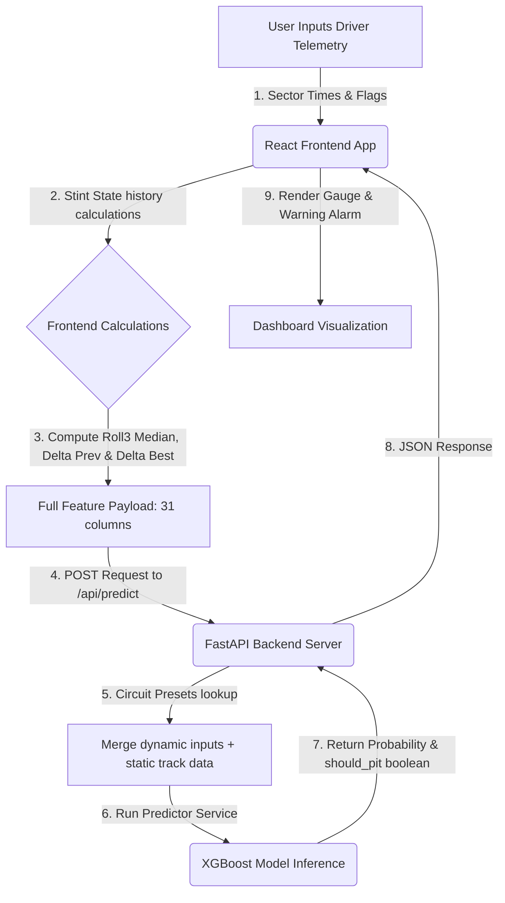

# 🏎️ F1 Pit Stop Predictor & Strategy Dashboard

An end-to-end Machine Learning web application designed to predict real-time Formula 1 pit stop decisions. Built on historical race telemetry, the app leverages an optimized XGBoost classifier to calculate pit stop probabilities and alert race engineers when it is time to **BOX**.

---

## 📊 Project Data Lifecycle

The machine learning model is trained on telemetry gathered from modern F1 race seasons. Here is how the data is collected, processed, and trained:

### 1. Telemetry & Data Collection (`notebooks/`)

* **Source:** Historical telemetry data fetched programmatically via the **FastF1 API** (2022–2024 seasons).
* **Scope:** Laps, tire compounds, compound ages, driver positions, safety cars, and track conditions.
* **Track Presets:** Physical characteristics of circuits (track length, number of corners, average pit lane loss, direction, tyre stress levels, and overtaking difficulty) are extracted and stored.

### 2. Feature Engineering Logic

To enable the machine learning model to track tyre degradation over time, three critical stint-based history metrics are engineered (modeled in `02_feature_engineering_eda.ipynb`):

* **`lap_time_roll3` (Rolling Median):** The rolling median of the last 3 laps (including the current lap). We use the *median* rather than a simple average to prevent traffic yellow flags or temporary sector traffic spikes from skewing the tyre wear indicator.
* **`lap_time_delta_prev` (Previous Lap Delta):** The difference between the active lap time and the previous lap time (`LapTime_current - LapTime_previous`). This captures sudden drop-offs in tyre grip.
* **`lap_time_delta_best` (Best Stint Delta):** The difference between the active lap time and the absolute fastest lap time recorded in the current stint (`LapTime_current - Min_LapTime_in_stint`). This indicates cumulative tyre wear relative to optimal performance.

### 3. Model Training & Optimal Threshold

* **Algorithm:** XGBoost Binary Classifier.
* **Training Target:** Predict whether a driver will pit on the *next* lap (`1` for pit, `0` for stay out).
* **Central Threshold (Single Source of Truth):** The model is saved inside `models/best_model.pkl` along with its features and its optimal classification threshold of **`0.86`** (derived from the ROC curve during training). If the predicted pit probability is `0.86` or higher, the system calls for a pit stop.

---

## 🔀 System Architecture & Data Flow

Below is the real-time data flow from user interaction in the browser to model inference in the backend and back again:



---

## 🛠️ Project Setup & Installation

### Backend Setup (FastAPI)

1. Navigate to the root directory and ensure the virtual environment is ready:
   ```bash
   source venv/bin/activate
   pip install -r backend/requirements.txt
   ```
2. Start the FastAPI development server:
   ```bash
   PYTHONPATH=. venv/bin/uvicorn backend.app.main:app --reload
   ```

   The backend will start on [http://localhost:8000](http://localhost:8000). Interactive Swagger documentation is available at [http://localhost:8000/docs](http://localhost:8000/docs).

### Frontend Setup (Vite + React)

1. Open a new terminal and navigate to the `frontend/` folder:
   ```bash
   cd frontend
   npm install
   ```
2. Configure your environment file. Create `frontend/.env` and specify the backend endpoint:
   ```env
   VITE_API_BASE_URL=http://localhost:8000
   ```
3. Run the development server:
   ```bash
   npm run dev
   ```

   The React dashboard will be accessible at [http://localhost:5173](http://localhost:5173).

---

## 🏁 Interactive Dashboard Features

* **Live Telemetry Form:** Real-time fields for Lap, Position, Tyre Compound, Tyre Age, and Sector times.
* **Flag Switches:** Highlight toggles for Safety Car (SC), Virtual Safety Car (VSC), and Red Flag.
* **Auto-Increment Workflow:** Clicking **"Record Lap & Advance"** adds the current lap to the stint log history and increments lap counters automatically.
* **Active Stint Resets:** Allows engineers to "Box for New Stint", resetting stint histories and resetting sector times back to base fast tyre pace.
* **Dynamic Semicircular Gauge:** Displays the probability dynamically using a custom SVG track indicator.
* **BOX Alarm:** The dashboard reads the model's threshold (`0.86`) from the API. If the probability equals or exceeds this threshold, the gauge turns red and flashes a **🚨 BOX BOX BOX 🚨** warning indicator.
* **Demo Segment Loader:** A diagnostic button labeled **"LOAD DEMO SEGMENT"** is included. It pre-loads 20 laps of degrading sector times on worn Soft tyres at Bahrain to easily test the model's pit stop calls.

---

## 🔮 Future Enhancements: Live Feed Integration

A planned enhancement is to connect the predictor directly to a live F1 data stream, removing the need for race engineers to manually input lap times and flag details during a live session.

### Potential Integration Pathways

1. **OpenF1 API (WebSocket / MQTT)**

   - **Concept:** Connect the application backend directly to the community-run OpenF1 live stream (`api.openf1.org`).
   - **Mechanism:** Subscribe to WebSocket or MQTT topics for `/v1/pit`, `/v1/laps`, and `/v1/position` to ingest real-time session events.
   - **Pros/Cons:** Easiest to implement as it provides structured, pre-parsed JSON objects, but real-time endpoints typically require an active subscription/sponsorship tier.
2. **Official F1 SignalR Feed**

   - **Concept:** Establish a direct, free connection to the official Formula 1 live timing backend at `livetiming.formula1.com/signalrcore`.
   - **Mechanism:** Initiate a negotiation handshake, connect to the `"Streaming"` hub, decompress the incoming raw-deflate (zlib) Base64 payloads, and merge the incoming delta updates into a local race-state object.
   - **Pros/Cons:** Completely free and zero-dependency, but highly complex to integrate from scratch due to undocumented payloads and frequent schema updates.
3. **Python Community Tooling (`livef1` / `FastF1`)**

   - **Concept:** Leverage pre-built Python packages designed to interface with F1's live timing feeds.
   - **Mechanism:** Spin up a background thread using the `livef1` library or `FastF1`'s client to handle the SignalR handshake and decompress the telemetry automatically.
   - **Pros/Cons:** Simplifies the integration of official feeds significantly, though it depends on active community maintenance when F1 updates their backend APIs.
